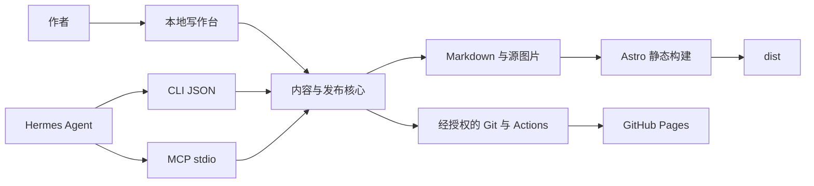

# 从静态博客到可被 Agent 操作的写作系统

本轮增加了混合主页、原创萌系插画、本地写作台、CLI 和 MCP。它们没有改变网站的部署方式：GitHub Pages 仍然只接收 `dist/`，本地 Node 服务只负责写作。日常使用步骤见 [操作指南](13-writing-and-agents.md)。

## 先拆开三个问题

内容如何保存、网站如何展示、如何触发部署，是三个不同的问题。让网页按钮直接写文件、让 CLI 另外写一套发布脚本，会使规则逐渐不一致。这里把输入适配和业务规则分开：



`tools/blog/contracts.mjs` 定义操作参数、说明和错误格式；`core.mjs` 管理内容；`storage.mjs` 负责文件边界、原子写入和锁；`publishing.mjs` 管理构建和发布任务。CLI、MCP、本地 HTTP 只转换输入输出，都调用 `createBlog(root).execute(operation, args)`。

这里的 HTTP 不是博客线上接口。写作台默认监听 `127.0.0.1:4323`，MCP 使用宿主启动的 stdio 进程，公开网页不需要连接它们。MCP 的协议输出独占 stdout，日志只能使用 stderr；这一约束来自 [MCP 官方服务器指南](https://modelcontextprotocol.io/docs/develop/build-server)。

## 混合信息流如何建模

文章与碎碎念保留自己的 collection 和字段规范，只在展示时合并。`published()` 返回 `posts`、`moments` 和共同排序的 `all`。主页根据 `entry.collection` 选择 PostCard 或 MomentCard：前者显示标题、摘要，后者通过 Astro `render()` 展示全文，所以正文配图、Markdown 和阅读工具自然保留。

没有把两类数据强行塞进相同的“文章摘要”结构，也没有复制正文到第二个数据源。碎碎念没有标题时仍然可以独立展示和访问，日期链接通向详情页。

`PAGE_SIZE` 集中在 `src/lib/pagination.ts`，目前为 6。首页第一页是 `/`，后续为 `/page/2/`；独立列表分别为 `/posts/`、`/posts/page/2/` 与对应的 moments 路径。页面数量在构建时确定，无须浏览器调用服务端翻页接口。路由和 sitemap 复用同一套页数与路径计算；链接统一经 `url()` 添加仓库子路径。静态分页的构建机制可参考 [Astro 路由文档](https://docs.astro.build/en/guides/routing/#pagination)。

练习：把每页数量改为 4，运行构建，观察主页页数与 sitemap；把两个条目的发布时间设为相同，观察 ID 排序使结果保持稳定。不要用 `updated` 排序，否则改一个错字就会使旧文章跑到首页最前。

## 可爱感来自哪里

保留纸白与雾蓝的语义色变量。更明显的可爱感集中在新的蓝发 Q 版小作家与白猫插画，内容卡片采用较圆的边角、柔和背景和小型内容类别标签；文章文字仍保持正常字号、对比度和行距。不同内容平行展示，不意味着所有卡片必须一样高。

图片原稿保留在源目录，网页使用 1200×800 和 600×400 的 WebP，通过 `srcset` 与 `sizes` 让浏览器选择合适文件。明确宽高可以减少加载时的布局跳动。首屏插画优先加载，正文图片保留原来的按需加载方式。原图与提示词见 [图片来源](assets/image-generation.md)。

不要在暗色主题里简单反转整张图片颜色。我们保留插画本色，使用暗色界面变量承接图片；也没有引入自动播放、跟随鼠标或大面积动效。

## 稳定 ID、revision 与请求 ID 分别解决什么

| 标识      | 示例                   | 作用                               |
| --------- | ---------------------- | ---------------------------------- |
| 内容 ID   | `posts/learning-notes` | 永久定位文件和内容；改标题不改 URL |
| revision  | 文件内容的 SHA-256     | 判断调用方是否基于最新文件修改     |
| requestId | UUID                   | 判断一次写入是否是网络重试         |
| jobId     | UUID                   | 跟踪一次发布流程及结果             |

更新必须携带上次读取到的 `expectedRevision`。如果你在写作台编辑时 Hermes 改了同一篇文章，保存会返回 `REVISION_CONFLICT`，编辑框中的文字保留。正确操作是重新读取、合并后再提交，不能拿新版本号强行覆盖。

写操作采用项目级 `.blog/lock`，避免几个入口同时写入。先把内容写到同目录临时文件，再 rename 替换目标，减少半文件状态。锁只能协调本工具参与者；外部编辑器不遵守锁，所以仍然需要 revision 检查。它不是数据库事务，也不能保证在断电和任意外部进程写入情况下绝对无冲突。

请求记录先持久化，再做修改；结果也持久化。同一 requestId 与相同参数直接返回原结果，不再新建文章或发布任务；同 ID 不同参数会拒绝。进程中断留下无结果记录时，返回 `REQUEST_INTERRUPTED` 并要求核对源文件或任务，不自动重复执行可能已经发生的操作。锁异常遗留的恢复方法见操作指南。

## 图片与草稿为什么不会靠隐藏链接来保护

`public/` 会直接进入生产文件，因此导入的图片存入 `src/assets/uploads/`，以压缩结果的哈希命名。工具解码栅格图片、限制大小与像素数、转换 WebP，返回相对 Markdown 引用。只有正文引用了它，Astro 才把它纳入资源图；生产内容加载器在解析图片依赖之前排除草稿。

工作台上传经过文件选择器和 base64 请求；CLI/MCP 可以显式传本机文件路径。网页 API 不接受任意文件路径。核心检查内容路径与真实路径，拒绝目录穿越及指向项目外的符号链接。导入的原图不会放入 public。

隔离有两层：内容加载阶段排除草稿，生产扫描再次核对草稿路由、专用图片、公共列表、RSS 和 sitemap。工具不清理未引用图片，避免意外删除仍需使用的素材。普通 Markdown 行内图片是工具支持的资源管理路径；手写 HTML、脚本或复杂引用形式需要作者自行审查，不能把任意不受信任 HTML 当成安全内容直接发布。

## 发布流程为何要有“演练”

本地发布演练把必要源文件复制到 `.blog/staging/<uuid>`，用临时依赖链接复用 node_modules，在副本中把目标设为已发布或草稿，然后运行真实 Astro 构建和生产扫描。无论成功失败都清理副本；不会覆盖原 `dist`，也不会把源稿临时标成已发布。

真实模式需要用户预先配置 `.blog/publish.json` 并明确启用。先检查目标仓库、当前分支、暂存区、工作区范围和远程同步；只允许提交本篇内容及其引用图片，不顺带提交其他修改。隔离构建完成后再次检查版本和 Git 状态，再提交与推送。配置不存访问令牌，Git/GitHub CLI 使用各自的本机凭据机制。

“已推送”和“已上线”是两个状态。status 根据发布任务的提交 SHA 查询对应工作流，运行成功后才返回上线或撤回结果及链接。历史 job 描述的是该次提交的部署，不是对网站此刻所有内容的持续监控。失败不会被伪装为模拟成功；重放同一请求也不会自动重新推送。

当前没有授权的远程仓库，因此真实 GitHub Pages 发布还需要你提供目标后完成首次联调。已实现的远程路径不等于已经在你的账号上线。暂存或推送途中中断时，应先核对记录中的 commit、远程分支和 Actions，再恢复，不要直接再次“新建文章”。

## 本地预览中发现的两个问题

新文件保存后，Astro 的文件监听和路由缓存更新不是瞬间完成。preview 操作会短暂等待详情 URL 可读，再把链接交给写作台；后续修改通过开发服务器热更新反映。没有运行预览服务时，接口仍可返回启动说明和 URL，不声称已预览成功。

隔离构建的配置和产物不能进入开发监听范围，否则一次演练会触发主预览服务重启。因此 Vite 明确忽略 `.blog` 和项目自己的 `.cache`。iframe 使用独立预览端口，允许它以自己的源加载样式与脚本；写作台请求仍受源检查和随机会话 token 保护。

## 如何复现验收

```powershell
npm.cmd run verify:complete
```

工具测试在临时目录运行，工作台浏览器测试使用 `.cache/studio-fixture`，不会把测试文章写进正式内容。覆盖幂等、版本冲突、图片、实际 CLI、实际 MCP 客户端、HTTP 边界、发布/撤回演练、坏链接阻止发布和内容增长后的分页。网站回归保留第二阶段所有阅读工具，并新增混合主页检查。

请读 [本轮验收记录](15-validation.md) 中的实际结果与未验证边界，不要把“写了测试”当作“测试通过”。若要继续迭代，先记录具体体验问题与可验收目标，再修改对应层，避免让 CLI、MCP 和网页各自演化出一套规则。
